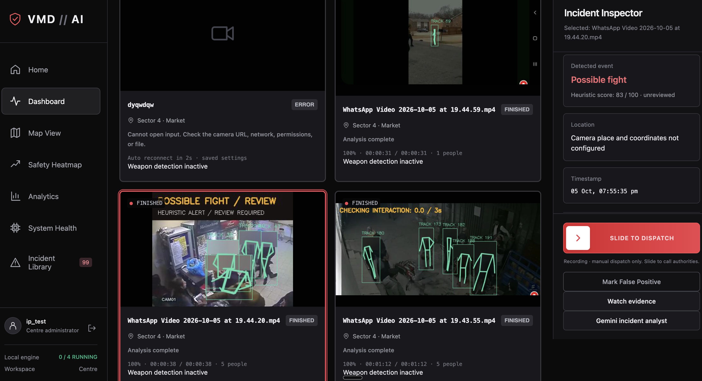
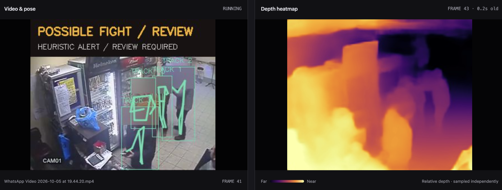
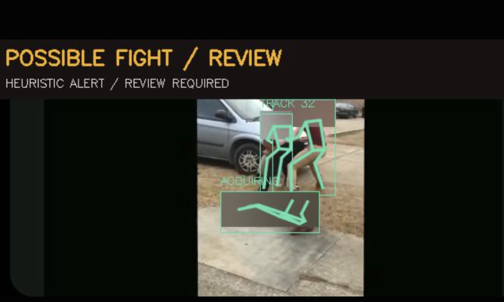
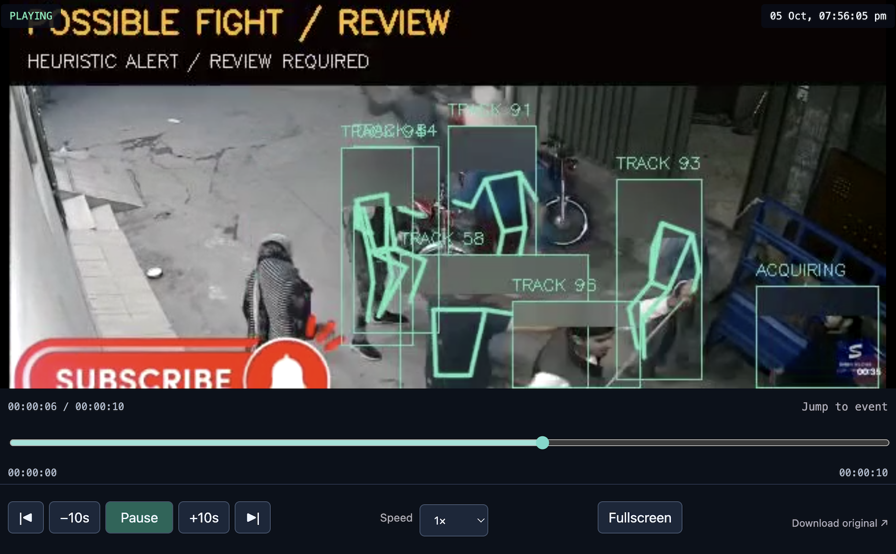
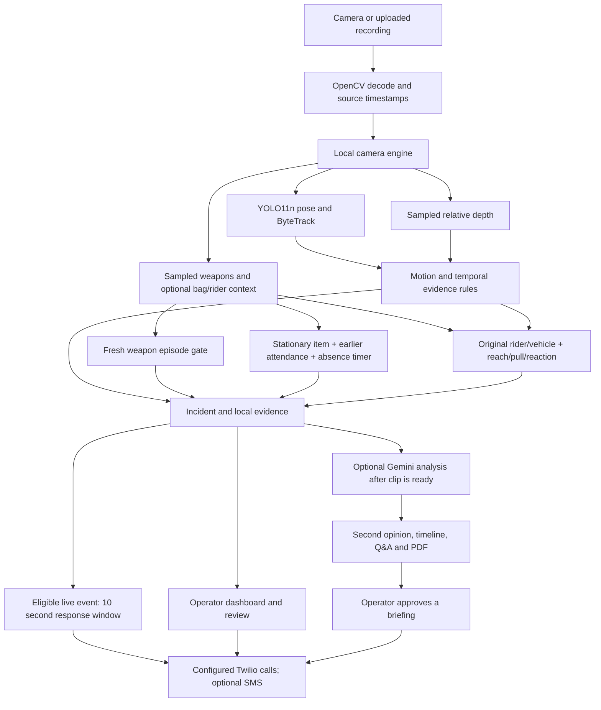
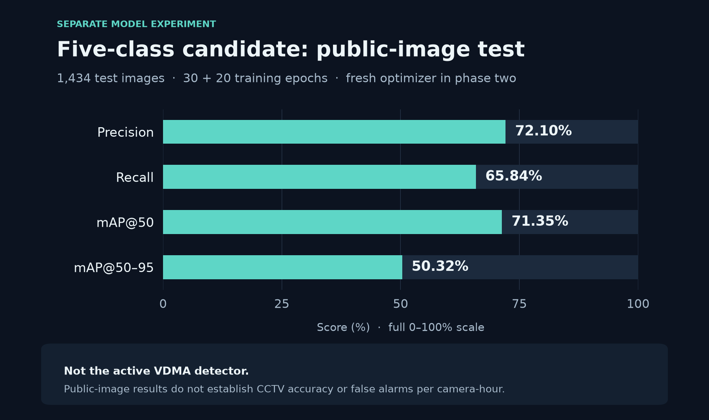
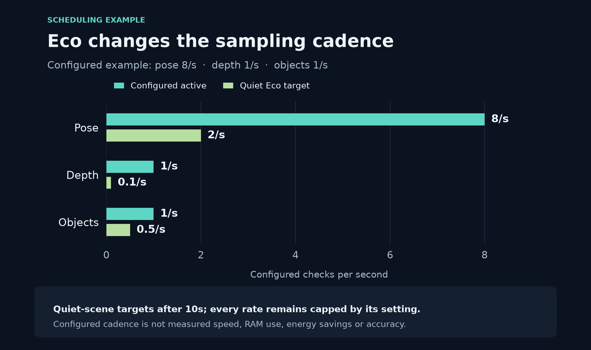

# VDMA / VMD Shield

VDMA turns camera feeds and recorded video into reviewable incident alerts, saved evidence and a response workflow. Its core runs locally: pose tracking, motion, relative depth and a specialist weapon detector provide observations; temporal rules decide when to raise an alert. Gemini adds a second opinion, an evidence timeline and reports after an incident is saved.

This is a working prototype. It supports up to four camera/analysis sessions, but that limit is an application setting, not proof that four busy feeds fit on a 4 GB device. Fight and snatching decisions are rule-based, not a trained video violence classifier An alert, a detector confidence score and a human-confirmed incident are different things.


## See it in action



The dashboard brings camera views, evidence playback and response controls into one place. The screenshots below are the original prototype images from our Hackdays presentation. **“Possible fight” is a review warning**, not a confirmed incident.

### Watch the demo

https://github.com/user-attachments/assets/acef60d4-8c75-423e-9bb5-45378bec69a8

[Open or download the full video](docs/media/ev1.mp4) · 19.7 sec · 14.7 MB. The demo shows VDMA's video analysis, sampled depth view and a **Possible snatching / Review** alert. It shows one prototype session, not a detection-accuracy benchmark.

### What the operator sees



**Pose + depth:** local tracking shows people and movement; the sampled depth view adds relative scene context. The heatmap does not measure distance in metres.

<table>
  <tr>
    <td width="50%"></td>
    <td width="50%"></td>
  </tr>
  <tr>
    <td><strong>Review the warning.</strong><br>Pose and movement checks explain why a scene needs attention. Operators can hide the drawings on current previews while detection continues.</td>
    <td><strong>Go back to the evidence.</strong><br>Replay the saved clip, jump to the event and download the original. Gemini can add an evidence timeline and report in the background.</td>
  </tr>
</table>

Only the supplied video and four presentation screenshots are included here. [Media and chart notes](docs/media/README.md) explain the assets and chart data.

## Contents

- [See it in action](#see-it-in-action)
- [Install and run](#install-and-run)
- [Current capabilities](#current-capabilities)
- [How an incident moves through the system](#how-an-incident-moves-through-the-system)
- [Models and training](#models-and-training)
- [Gemini: the additional evidence layer](#gemini-the-additional-evidence-layer)
- [Calling, response and evidence sharing](#calling-response-and-evidence-sharing)
- [Storage, authentication and configuration](#storage-authentication-and-configuration)
- [Performance and the 4 GB target](#performance-and-the-4-gb-target)
- [Validation and API documentation](#validation-and-api-documentation)

## Install and run

Use Python **3.10–3.13**; Python 3.11 is the development setup. Run commands from the repository root. Neural inference needs the `vision` extra; ONNX preparation needs `depth-export`. The `ai` extra adds Gemini authentication/SDK support, PDF generation and `.env` loading.

```sh
python3.11 -m venv .venv
.venv/bin/python -m pip install -e '.[vision,depth-export,ai,test]'
.venv/bin/python scripts/download_models.py --depth zipdepth --objects
cp -n .env.example .env
```

Edit the private `.env` before enabling cloud features. Set `VMD_AI_ENABLED=false` for an entirely local first run; enable it after choosing a billing project, credentials and model IDs. Keep calling and SMS disabled in Centre settings until their provider configuration is ready. The copy command preserves an existing `.env`.

```sh
.venv/bin/python -m vmd
```

Open **<http://127.0.0.1:8765>**, register this installation's centre and add a camera or upload a recording. There is no frontend build step. On macOS, `start.command` starts the same application. Once the environment exists, subsequent runs only need the last command.

If port 8765 is occupied, check whether the existing service is VDMA and use its dashboard. Do not start a second copy against the same installation. To intentionally run a separate instance with separate data on another free port:

```sh
VMD_DATA_DIR=data-secondary .venv/bin/python -m uvicorn vmd.api:app --host 127.0.0.1 --port 8875 --env-file .env --no-access-log
```

Adjust `VMD_REPORT_BASE_URL` for automatically saved PDF links when changing the dashboard port. Keep the dashboard bound to loopback. External access uses the separate gateways described below.

### Connect an input

1. **Register/sign in.** One centre belongs to this installation. Enter authority and hospital contacts; these are the response destinations.
2. **Add camera.** Use a webcam index such as `0`, the actual HTTP/MJPEG or RTSP stream, or a local video file. A camera's administration webpage is not a video source. The phone/camera must be reachable from this computer; sharing a Wi-Fi name does not rule out network isolation.
3. **Choose analysis settings.** The camera form defaults to Depth-confirmed mode, ZipDepth and sampled weapon detection. CPU, Apple MPS, CUDA and automatic device selection are supported. API defaults differ, so API clients should send their intended settings explicitly.
4. **Check location.** Browser geolocation describes the dashboard computer. It does not independently locate a remote phone or verify the camera site. Incidents keep their original location snapshot; editing a camera later does not rewrite old evidence.
5. **Review saved events.** The Incident Library provides playback, review labels, downloads and manual dispatch. Uploaded recordings end normally; they never trigger automatic calls or restart as persistent live cameras.

**Add pipeline test** uses synthetic observations to exercise UI/state behavior. The **Demo network** contains presentation records. Neither establishes model accuracy nor contacts real recipients.

## Current capabilities

| Capability | Current behavior | Practical boundary |
| --- | --- | --- |
| Camera monitoring | Independent state, pose tracks, motion and sampled depth/object views; up to four sessions | CPU, RAM, decoding and sampling determine usable capacity |
| Fight checks | Anatomical contact, motion, reciprocal interaction, source-time duration and fresh matching depth | Brief events, occlusion and unreliable depth can prevent confirmation |
| Posture/snatching checks | Configurable lying-still dwell, standing reach–pull–departure checks and optional rider review | Observations do not prove injury or theft; rider alerts require operator review |
| Unattended items | Optional stationary backpack/handbag/suitcase monitoring with a per-camera absence timer | Requires earlier observed nearby attendance; cannot establish ownership or contents |
| Weapon alerts | Pinned YOLOv8n specialist; fresh gun/knife predictions strictly above 90% are public | Confidence is not calibrated correctness; small/obscured weapons can be missed |
| Eco mode | Reduced quiet-scene inference; motion and active checks restore configured rates | Capture stays connected; counts are not measured energy savings |
| Camera recovery | Saved live sources reconnect with backoff capped at 60 seconds | Stop persists; a changed phone IP is not discovered automatically |
| Evidence | Local clips, originals, H.264 playback caches, reviews and response history | Saved playback, not continuous live DVR; no automatic retention purge |
| Response | Persistent ten-second eligible-live-event countdown, immediate manual dispatch, optional hospital calls | Twilio configuration and enabled centre toggle required; recordings manual-only |
| Gemini | Background clip review, timeline, Q&A, PDF/JSON and bounded Follow | Optional cloud layer; no detector/policy control or automatic briefing approval |
| Analytics/maps | Saved-data queries and original location snapshots | Demo records remain separate; missing coordinates are not invented |
| Mobile access | Separate authenticated read-only incident-metadata API | Viewing on a phone is not on-device neural processing |

## How an incident moves through the system



Local response and cloud review run independently. **Calls do not wait for Gemini.** An approved report can enrich future calls or SMS; it cannot change an announcement already submitted.

### Evidence checks rather than one-frame decisions

- **Pose/motion:** YOLO11n supplies boxes/keypoints; ByteTrack associates people within a camera session. Optical flow helps distinguish local movement from camera motion. Track IDs are temporary associations, not identities.
- **Depth:** ZipDepth gives normalized relative inverse depth, not metres. Samples keep their original frame/time provenance. Old or mismatched depth cannot confirm a current contact.
- **Duration:** fight escalation is configurable from 0.5–10 seconds, default 3. It controls supported interaction time without bypassing motion/contact/depth gates. Unsupported gaps pause or reset the clock. Depth-confirmed mode requires depth sampling of at least 0.5 Hz. Review-only mode (`responsive` in the API) saves provisional warnings and cannot confirm fights.
- **Weapons:** checks work without a tracked person. YOLO26s supplies people for best-effort head blur and optional bag/vehicle context; its general-object/knife predictions are not fallback weapon alerts. Stale, failed or stopped samples clear the weapon action. Clear intervals/cooldowns re-arm a visible-weapon episode rather than creating an incident on every poll.
- **Bounded work:** capture and asynchronous workers prefer the latest frame over an accumulating backlog. Encoding uses a bounded storage queue. Sampling gaps still reduce evidence; dropping backlog cannot recover actions that were skipped.

See [architecture.md](architecture.md), [interaction checks](docs/interaction-heuristics.md) and [detection history/provenance](docs/detection-update.md). Historical sections describe earlier thresholds/behavior; current code governs.

### Pose and box display

Click **Hide pose & boxes** above the camera grid or in the feed viewer to hide detection drawings across the current camera previews. Click **Show pose & boxes** to restore them. This browser remembers the choice. It is a display option: detection, alerts and evidence continue without restarting a camera. Head blur and incident banners remain visible; saved evidence keeps its original annotations. Clean pose previews are encoded on request and cached for the current frame, using the existing detections rather than rerunning a model.

### Item, chain-snatching and lying-person alerts

Open **Add camera** or select a camera and open **Settings**. Enable **Unattended bags & suitcases**, then set **Unattended item: alarm after** to 10–3600 seconds (default 60). **Person lying still: alarm after** is independently editable from 1–60 seconds (default 3). Settings belong to that camera, persist for saved live sources and restart a running camera briefly when applied.

Unattended checks reuse YOLO26s for people, backpacks, handbags and suitcases. A stationary bag must first be seen beside exactly one nearby confident person for at least two source seconds and three samples. The alarm timer then counts only continuously observed time with no detected nearby person. Someone returning, item movement, lost visibility, ambiguous matching, a sample gap or camera movement breaks the pending check. A bag present alone when monitoring starts remains unarmed. The dashboard shows the last accepted sample's countdown rather than advancing a timer over missing footage. Uploaded videos sample sequentially in video time; live inference keeps bounded queues. Enable **alarm sound** for a local chime on a new live item/person-down/fall incident.

Bag checks can run with **Knife & gun detection off**; this uses the existing `models/yolo26s.pt` without loading the weapon specialist. Bags clear a 0.5 model-score cutoff; weak visible people can interrupt absence but cannot arm it. An item alarm saves a reviewable `unattended_object` incident and local evidence. It can enter the existing optional Gemini reporting workflow. It does not start an automatic phone-response countdown; explicit manual dispatch remains available.

Standing chain-snatching checks tolerate one hidden hip, require arm movement relative to the actor's torso, reject track jumps and victim-only separation, and retain enough departure observations at 2 FPS. A supported collar reach, pull and same-actor departure are movement hypotheses; they do not show that a chain was taken. Original-contact depth requirements remain.

**Rider snatching review** is a separate opt-in setting (`snatching_vehicles=false` by default). It combines a near-neck reach and supported pull with the same rider/original vehicle moving and the other person's supported reaction toward the rider or fall. It reuses `models/yolo26s.pt`, can run with weapon detection off, and saves a **review alert**, never a confirmed-theft label or automatic-call trigger. Enable it in Add camera or Edit detection settings; reanalyse a recording after changing the setting because old saved incidents are not reclassified. Occluded wrists, broken tracking and ambiguous vehicle matches can prevent an alert; an ordinary exchange can also resemble the sequence. See the [interaction checks](docs/interaction-heuristics.md) for exact sequence gates and limitations.

Person-down checks support one hidden hip and diagonal bodies when a visible straight leg corroborates the posture; seated/bent or moving bodies cannot complete the lying-still timer. These are regression-tested rules, not measured CCTV accuracy.

## Models and training

The live pipeline currently uses **YOLO11n pose, optical flow, ZipDepth through ONNX Runtime, YOLO26s and a separate YOLOv8n threat detector**. YOLO26s supplies people for preview privacy, backpack/handbag/suitcase observations with unattended checks, and vehicle context with rider review. Only the specialist's gun/knife observations create weapon alerts. The added temporal rules require no additional model or training.

### Which model goes where

Model binaries are deliberately excluded from Git. The installers create the layout below. Copying an arbitrary checkpoint named `best.pt` does not replace a pinned detector.

| Asset | Location relative to repository root | Role / installation |
| --- | --- | --- |
| YOLO11n pose | `models/yolo11n-pose.pt` | Required for real pose processing; `scripts/download_models.py` |
| ZipDepth ONNX | `models/zipdepth-91f3fd2.onnx` | Recommended depth runtime; `scripts/download_depth_model.py` |
| ZipDepth integrity manifest | `models/zipdepth-91f3fd2.json` | Required with ONNX; verifies revision and checkpoint/export hashes |
| ZipDepth licence | `models/ZipDepth-LICENSE.txt` | Installer preserves source/export provenance and notice |
| YOLO26s | `models/yolo26s.pt` | Person context; opt-in bag monitoring and rider/vehicle review |
| Active gun/knife specialist | `models/assalim-normal-compressed-best.pt` | Assalim Normal_Compressed YOLOv8n; `0: guns`, `1: knife` |
| Specialist licence | `models/Assalim-GPL-3.0.txt` | Downloaded with the pinned specialist |
| MiDaS Small, optional | `models/midas_v21_small_256.pt`, `models/MiDaS/`, `models/efficientnet/` | Only needed for `MiDaS_small` |
| DPT Hybrid, optional | `models/dpt_hybrid_384.pt`, `models/MiDaS/` | Only needed for `DPT_Hybrid` |
| DPT Large, optional | `models/dpt_large_384.pt`, `models/MiDaS/` | Only needed for `DPT_Large` |

Recommended complete install:

```sh
.venv/bin/python scripts/download_models.py --depth zipdepth --objects
```

For an existing pose setup, install the other assets separately:

```sh
.venv/bin/python scripts/download_depth_model.py
.venv/bin/python scripts/download_object_model.py
```

Legacy depth alternatives use `scripts/download_models.py --depth small`, `--depth hybrid` or `--depth large`. They are not requirements for ZipDepth. The ZipDepth installer fetches pinned sources/checkpoint, exports ONNX and checks parity at multiple input shapes. Runtime uses a single-thread ONNX Runtime CPU session, independently of pose's device.

`VMD_MODEL_DIR` changes the application's model root; download scripts still write to the repository's `models/`. When using another root, move the complete verified assets together. Do not separate ONNX from its manifest.

The active specialist comes from [JoaoAssalim/Weapons-and-Knives-Detector-with-YOLOv8](https://github.com/JoaoAssalim/Weapons-and-Knives-Detector-with-YOLOv8), pinned revision `3d641e6001abdaa1afa3cd45d0fe02a9554f3d0e`. Checkpoint SHA-256: `21d61ad8068caca3062d33fd8d05da445ef9ae81a2bb817249e085b0f1307cf0`. Loading validates hash/class map and uses restricted `weights_only=True` loading with installed-class allowlisting. Its pinned licence is GPL-3.0; the upstream README's MIT claim conflicts with that file. Models and dependencies have separate licences to review before redistribution/deployment.

### Training included in this checkout

The local [Colab notebook](notebooks/train_vdma_weapons_colab.ipynb) and [training guide](docs/weapon-training.md) prepare a **two-class gun/knife replacement candidate**. They use public positives, explicitly reviewed hard negatives, session-separated local footage, duplicate checks, validation-only threshold selection and held-out testing. The default fine-tunes a fresh pretrained YOLOv8s; scratch training is optional.

The notebook does not deploy its output. Keep candidates separately, for example under ignored `models/candidates/`, until held-out accuracy, mapping, threshold behavior and target-device latency are checked. Integration needs intentional filename/hash/loader changes in `vmd/objects.py` and regression checks. Overwriting the specialist is insufficient.

**Incident review in this checkout only saves labels; it does not train a model.** No ResNet18/GRU learner is wired into `vmd`. The local clip learner in the related [00surya/vdm-shield](https://github.com/00surya/vdm-shield) project uses a frozen ResNet18 encoder with a trainable GRU head. Reviewing clips there trains that clip classifier; it does not fine-tune object or depth models. That separate learner is not required by this application's live pipeline.

### Five-class weapon and ordnance experiment

The following supplied evaluation summary belongs to the separate experiment in [00surya/vdm-shield](https://github.com/00surya/vdm-shield/blob/main/docs/weapon-ordnance-experiment.md). Its detector completed **30 epochs followed by 20 additional fine-tuning epochs**. The second phase starts with fresh optimizer state. It is a candidate model and **has not replaced the detector in this application**.



| Evaluation of the 50-epoch candidate | Result |
| --- | --- |
| Test images | 1,434 |
| Precision | 72.10% |
| Recall | 65.84% |
| mAP@50 | 71.35% |
| mAP@50–95 | 50.32% |

These results are on the prepared public-image test split, including close-up ordnance photographs. They do not measure false alarms per camera-hour or establish CCTV performance. The classes are **gun, knife, grenade, bomb and other ordnance**; a camera cannot determine whether an object contains live explosives.

Data comes from [fcakyon/gun-object-detection](https://huggingface.co/datasets/fcakyon/gun-object-detection) and [CTX-UXO](https://huggingface.co/datasets/UXO-Politehnica-Bucharest/Contextual_Vision_for_Unexploded_Ordnances). Source attribution, mappings, checksums, split limitations and complete results are in the [experiment notes](https://github.com/00surya/vdm-shield/blob/main/docs/weapon-ordnance-experiment.md).

For another run, use that experiment's [Colab notebook](https://github.com/00surya/vdm-shield/blob/main/notebooks/weapon_training_colab.ipynb) and [training kit](https://github.com/00surya/vdm-shield/blob/main/docs/weapon-colab.md). Scripts download/prepare data, validate annotations, train, evaluate and export. **In that training kit**, `scripts/export_weapons.py` provides ONNX, OpenVINO, Core ML and TensorRT targets with platform-specific prerequisites. That script and five-class notebook are external references, not files in this checkout. Conversion alone does not guarantee a speedup: benchmark and evaluate the exported model on the intended device.

## Gemini: the additional evidence layer

Gemini helps an operator understand saved evidence and assemble a response. It is optional and can be disabled without removing local camera detection.

| Feature | Contribution | Control / limit |
| --- | --- | --- |
| Second opinion | Summary, visible subjects, supporting/contradicting/unclear assessment | Does not overwrite the local incident or review |
| Timeline | Relative timestamps and visible action sequence | Sampled frames can omit actions; uncertainties are included |
| Evidence Q&A | Answers with evidence-second references and limitations | Bounded clip frames reread; questions/answers are not persisted |
| Automatic report | Background review when a new eligible clip is ready; private PDF and JSON | Default when AI enabled/configured; no bulk historical upload |
| PDF | Incident metadata, representative image, timeline and video link | Link needs dashboard reachability and existing sign-in |
| Briefing | Optional observational text for future calls/SMS | Operator approval required; submitted communications cannot be changed |
| Aftermath Follow | Fresh processed frames from the same physical-camera session | Opt-in; ten-second windows for up to two minutes |
| Conversational voice | Gemini Live answers from saved metadata/observations in a Twilio call | Separate HTTPS gateway and real-call commissioning required |

### Vertex AI authentication

Vertex AI uses a Google Cloud identity and billing project. An API key is not required for that backend. `GOOGLE_CLIENT_ID` and `GOOGLE_CLIENT_SECRET` identify an OAuth application; they do not by themselves authorize Vertex requests.

Set private configuration using your own project and accessible models:

```dotenv
VMD_AI_ENABLED=true
VMD_AI_BACKEND=vertex
VMD_AI_VERTEX_PROJECT=YOUR_PROJECT_ID
VMD_AI_VERTEX_LOCATION=global
VMD_AI_FAST_MODEL=gemini-3.1-flash-lite
VMD_AI_QUALITY_MODEL=gemini-3.5-flash
VMD_AI_AUTO_ANALYZE=true
VMD_AI_AUTO_FOLLOW=false
VMD_AI_HOURLY_LIMIT=60
VMD_REPORT_BASE_URL=http://127.0.0.1:8765
```

These IDs are application defaults, not guaranteed model availability in every project/region. Enable Vertex AI/billing and give the identity required access. No silent fallback selects another paid model. `CLIMBRK_AI_VERTEX_PROJECT`, `CLIMBRK_AI_VERTEX_LOCATION`, `CLIMBRK_AI_FAST_MODEL` and `CLIMBRK_AI_QUALITY_MODEL` aliases apply when corresponding `VMD_AI_*` values are absent.

Choose either authentication method:

- **Local OAuth helper:** set `GOOGLE_CLIENT_ID`, `GOOGLE_CLIENT_SECRET` and `VMD_GOOGLE_CREDENTIALS_FILE=data/google-credentials.json` privately; run `.venv/bin/python scripts/google_login.py`. Use a Desktop OAuth client, or register the exact web-client redirect `http://localhost:8089/`. The helper saves a refresh credential with owner-only permissions.
- **Application Default Credentials:** run `gcloud auth application-default login` and `gcloud auth application-default set-quota-project YOUR_PROJECT_ID`. Omit `VMD_GOOGLE_CREDENTIALS_FILE` when selecting ADC. `GOOGLE_APPLICATION_CREDENTIALS` is also supported by the ADC loader.

Sign-in is setup, not a requirement on every restart. Saved refresh credentials/ADC are reused; revoked/expired authorization can require signing in again. Startup does not open consent or submit an analysis. Automatic analysis can subsequently submit billable requests for newly eligible saved evidence.

For the API-key backend, set `VMD_AI_BACKEND=api` and supply `GEMINI_API_KEY` privately. See [Gemini setup](docs/gemini-setup.md) for full configuration and voice commissioning.

### Limits and uncertainty

Initial review accepts decodable clips up to **120 seconds**, samples at most **48 JPEG frames / 8 MiB**, and caps the longest side at **768 pixels**. It sends selected frames, not the stream URL or recording library. The current review path does not analyze the clip's audio.

One analysis/question provider request runs at a time, with at most eight queued jobs and a persistent hourly cap, default 60 attempts. SDK retries are disabled. Limits bound concurrency/request count, not the invoice: token usage, output/reasoning, follow windows, questions and selected model determine cost. Project credits do not remove these usage limits.

Follow has a separate processed-frame buffer bounded to 30 seconds / 8 MiB, sampled at 2 FPS. It stops on stale/stopped/reconnected sources, changed evidence, false-positive review, explicit Stop, expiry or two windows reporting involved subjects absent. Recordings cannot follow a live camera. Similar clothing is not reliable identity, and skipped frames cannot be reconstructed. Automatic Follow is off by default; restarts do not resume old sessions.

Reports are versioned against evidence; upgrades invalidate stale briefing approvals. Failed attempts are not resubmitted automatically every restart; explicit retry is available. Treat output as a draft. A staged test recognized an exchange/fall but misread a figure's final movement; that test does not establish CCTV accuracy.

## Calling, response and evidence sharing

### Automatic and manual response

New eligible **physical live-camera** `fight`, `knife_detected` and `snatching_detected` incidents start a server-owned **ten-second** response countdown. Acknowledge, Cancel or false-positive review stops further escalation. Confirming a review also acknowledges it. SQLite preserves the original deadline through refresh/restart.

The slider dispatches immediately. Gun/provisional events, including rider-snatching review, can be dispatched manually. Rider review does not create an automatic countdown. **Recordings are always manual-only**; calls identify recorded footage and give analysis time/source offset instead of inventing original capture time. Synthetic/presentation incidents cannot call or send SMS.

Calling needs a voice-capable Twilio sender, permitted recipients, valid credentials, saved centre contacts and the centre's **calling enabled** toggle. Set privately:

```dotenv
TWILIO_ACCOUNT_SID=YOUR_ACCOUNT_SID
TWILIO_AUTH_TOKEN=YOUR_AUTH_TOKEN
TWILIO_FROM_NUMBER=YOUR_E164_SENDER
TWILIO_VOICE_MODE=incident
```

Dynamic incident speech includes centre, event, saved camera location/coordinates and original detection time. It uses TwiML through a Twimlets Echo URL. Hospital requests are separate and do not redial authorities. There is one submission attempt per incident/phone; uncertain timeout/interruption outcomes are not blindly retried. Provider acceptance/completed status does not prove the recipient understood or acted.

Browser alarms need **Enable alarm sound** once per monitoring tab. Closed/suspended tabs cannot beep; the server countdown is independent. This calls configured contacts, not a public emergency dispatch integration.

### Video and expiring links

The library accepts supported recordings up to 1 GB and keeps originals locally. Browser playback prepares an H.264 MP4 cache through FFmpeg or `imageio-ffmpeg`; playback copies omit audio. Conversion failure does not remove the original download.

**Video link → Generate video link** prepares a one-hour HTTPS evidence URL without dispatching or contacting anyone. Anyone holding it can view until expiry/revocation. False-positive review/cancelled response blocks sharing. The gateway, computer and network must remain available.

With `cloudflared` installed, the managed development helper exposes only the evidence gateway:

```sh
.venv/bin/python scripts/evidence_tunnel.py start
.venv/bin/python scripts/evidence_tunnel.py status
.venv/bin/python scripts/evidence_tunnel.py stop
```

It uses port **8768**, keeps the dashboard private and stores host/process state locally. Quick Tunnel addresses change after restart; generate fresh links. This is development hosting, not guaranteed uptime. `VMD_EVIDENCE_BASE_URL` can choose a separately managed HTTPS evidence origin.

SMS is configured/enabled separately from voice and link generation. It can contain incident details, saved location/map and a video link. Missing required physical-camera location/evidence prevents sending; unknown recording locations remain explicitly unknown. See [response setup](docs/response-setup.md) for provider behavior.

Conversational `gemini_live` calling additionally needs `.venv/bin/python -m vmd.voice`, a dedicated HTTPS origin for port **8769**, an accessible Live model and `VMD_VOICE_PUBLIC_URL`. Its signed expiring call-bound gateway has read-only context; it cannot dispatch, call another person or send evidence. The implementation exists; model access, phone audio and real carrier outcomes need commissioning on the deployment account.

## Storage, authentication and configuration

| Area | Location | Contents |
| --- | --- | --- |
| Database | `data/telemetry.sqlite3` | Incidents, telemetry, reviews, centre/session, response and hashed sharing state |
| Camera registry | `data/cameras.json` | Sources/settings and enabled/stopped state; may include stream credentials |
| Evidence | `data/clips/` | Saved incident clips |
| Originals/caches | `data/recordings/`, `data/playback/` | Uploaded media and prepared MP4s |
| Report PDFs | `data/ai-reports/` | Incident metadata, images and observations |
| Private configuration | `.env`, optional files under `data/` | Google/Twilio credentials and public-host state |
| Models | `models/`, nested lab model directories | Downloaded/exported binaries and notices |

`VMD_DATA_DIR` and `VMD_MODEL_DIR` select alternative roots. Do not point multiple app instances at the same private data directory. Back up database/media together; no automated archive or retention policy exists.

Centre passwords use salted scrypt hashes; dashboard sessions use expiring HttpOnly/SameSite cookies. Host/origin checks and a client header protect API mutations. This is one centre per installation, not hosted multi-tenancy or separate staff permissions.

`python -m vmd`, `python -m vmd.voice` and the login helper load root `.env` through `python-dotenv` when installed; exported settings win. Direct Uvicorn launch needs explicit `--env-file .env` or exported configuration.

Keep secrets, camera URLs, databases, runtime recordings, caches, virtual environments and model weights out of Git. The explicitly selected public demo at `docs/media/ev1.mp4` is the only video exception. Presentation PDFs/PPTs and generated `output/` artifacts are excluded from this code publication. Checked-in static UI assets are still required. Head blur is best effort, not guaranteed anonymization; uploaded originals/evidence can remain sensitive.

## Performance and the 4 GB target

The current code provides CPU inference, quiet-scene scheduling, bounded buffers, latest-frame queues and asynchronous workers. It still creates per-camera model state/child processes. The ZipDepth worker currently imports Torch despite using ONNX for inference. Running memory is not checkpoint size.



The chart shows one configured example using the intervals in [`vmd/eco.py`](vmd/eco.py). Motion and active checks restore the configured rates. It shows how quiet scenes reduce scheduled work; device capacity still needs measurement.

| Existing technique | Reduces | Does not prove |
| --- | --- | --- |
| Eco after 10 quiet seconds | Pose to 2 checks/sec, depth every 10 sec, objects every 2 sec, capped by configured rates | Four busy feeds in 4 GB, energy savings or unchanged recall |
| Latest-frame queues | Accumulated inference backlog | Every-frame processing/preservation of skipped actions |
| Bounded ZipDepth CPU session | Depth input/thread load | Whole-app memory or a Torch-free deployment |
| Bounded evidence | Incident buffer up to 10 seconds / 32 MiB per engine plus separate AI buffer | Unlimited recording or storage |
| Cloud reports | Local narrative-generation work | Removal of decoding, pose, depth or weapon inference |

**Target, not achieved capacity:** four concurrent feeds on a laptop/mobile CPU with 4 GB total RAM. The next proposed design shares native exported models through a fair bounded scheduler, uses low-resolution analysis streams and keeps per-camera tracking/rules. It requires deployment-time Torch removal, validation of smaller/quantized inputs and a native mobile capture/runtime adapter. A phone browser viewing the dashboard is not that implementation.

Acceptance needs named hardware and sustained testing with **all four scenes active**: total app/child-process peak RAM, OS headroom, per-camera sampling, decode load, backlog/staleness, incident/evidence correctness and mobile thermal behavior. Idle Eco tests cannot prove capacity. Judge export/quantization by end-to-end speed and detection parity, not file size.

## Validation and API documentation

```sh
.venv/bin/python -m pytest -q
node --test tests/*.test.mjs
```

Regression tests cover temporal/depth gates, weapon freshness/deduplication, recovery, media, auth, persistent response, calls/shares, Gemini queues/reports and UI state. Provider tests use fake responses/senders; they do not call real contacts or establish field accuracy. Check current results instead of treating an old test count as a release guarantee.

`scripts/benchmark_depth.py` and `scripts/benchmark_eco.py` provide bounded development measurements. `scripts/benchmark_pipeline.py` uses repeated sample imagery, not surveillance accuracy data. Operational validation needs representative labelled footage, independent sessions, false alarms/camera-hour, recall/detection delay and workload/device measurements. The five-class public-image results above answer a different question.

| Interface / guide | Role |
| --- | --- |
| Dashboard/API, `127.0.0.1:8765` | Centre session, camera controls, review, dispatch and AI reports |
| [Event-package API](docs/event-api.md) | Authenticated POST returns saved metadata and a fresh video link; no dispatch |
| [Mobile API](docs/mobile-api.md), port 8766 | Separate read-only database gateway with expiring bearer tokens; no controls/dispatch/video |
| Evidence gateway, port 8768 | Expiring/revocable token-gated MP4 playback |
| [Gemini setup](docs/gemini-setup.md), voice port 8769 | Auth, limits and optional signed audio bridge |
| [Android notes](docs/android-app.md) | Separate Expo client/relay; external app checkout not a main-app dependency |
| [Architecture](architecture.md) | Components/data contracts and historical context |
| [Runtime stability](docs/runtime-stability.md) | MPS concurrency and worker-lifecycle investigation |

Optional experiments remain isolated:

- [Decision Lab](decision-lab/README.md): GLiNER2.5-Decide text classification on port 8771. Weights go under `decision-lab/models/GLiNER2.5-Decide/`; `decision-lab/setup.sh` installs them. It is not an active incident decision model.
- [Vision Lab](vision-lab/README.md): Apple Silicon MLX single-frame descriptions on port 8770. Weights go under `vision-lab/models/lfm2.5-vl-450m-4bit/`; `vision-lab/setup.sh` installs them. It does not control VDMA alerts/response.

Neither lab is required. Their weights/environments are excluded from Git. Local inputs remain local unless the explicitly configured Gemini/evidence-sharing path is used.

### Source map

| Responsibility | Files |
| --- | --- |
| Startup/API/cameras | `vmd/__main__.py`, `vmd/api.py`, `vmd/cameras.py`, `vmd/capture.py` |
| Pose/tracking/motion | `vmd/vision.py`, `vmd/tracking.py`, `vmd/stabilization.py` |
| Temporal rules | `vmd/heuristics.py`, `vmd/behavior.py`, `vmd/confirmation.py`, `vmd/spatial.py`, `vmd/snatching.py`, `vmd/vehicle_snatching.py` |
| Depth/weapons/Eco | `vmd/depth.py`, `vmd/depth_worker.py`, `vmd/objects.py`, `vmd/eco.py` |
| Evidence/media | `vmd/engine.py`, `vmd/storage.py`, `vmd/media.py`, `vmd/evidence.py`, `vmd/share.py` |
| Centre/response | `vmd/centre.py`, `vmd/alerts.py`, `vmd/calling.py`, `vmd/delivery.py` |
| Gemini/PDF/voice | `vmd/gemini.py`, `vmd/incident_pdf.py`, `vmd/voice.py` |
| UI / model setup | `vmd/static/`, `scripts/download_*` |
